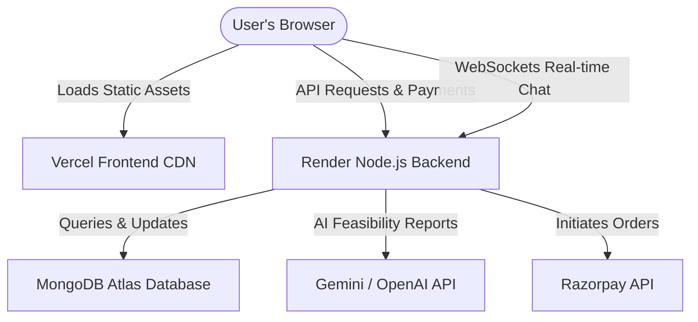

# Startup Sensai - Comprehensive Deployment Guide

Welcome to the ultimate deployment guide for **Startup Sensai**! This step-by-step manual will help you deploy your full-stack Node.js + Express backend (with WebSockets) and React + Vite frontend onto premium cloud platforms (**Render/Railway** and **Vercel**) completely free of charge.

Follow this guide sequentially to take your platform live with secure payments, real-time messaging, and AI feasibility reporting!

---

## 🗺️ Architectural Overview

We use **Option B (Decoupled Deployment)** for optimal performance, faster loading speeds, and scale:
*   **Backend (API & WebSockets)**: Hosted on **Render** (or **Railway**) as a persistent Web Service.
*   **Frontend (SPA Static Assets)**: Hosted on **Vercel** with global CDN edge network caching.
*   **Database**: Hosted on **MongoDB Atlas** (Cloud Database).
*   **Payments**: Secured by **Razorpay Live/Test**.



---

## Step 1: Set Up MongoDB Atlas (Database)

We need a production-ready, cloud-hosted MongoDB cluster.

1.  Go to [MongoDB Atlas](https://www.mongodb.com/cloud/atlas) and sign up for a free account.
2.  Create a new project named **Startup-Sensai**.
3.  Click **Create a Deployment** and select the **M0 (Free)** shared cluster option.
4.  Choose your closest cloud provider region (e.g., AWS / Mumbai for India).
5.  **Set up Database Access Security**:
    *   Create a database user (e.g., username: `sensai-admin`).
    *   Generate a secure password and **save it in a safe place**.
6.  **Set up Network Access Security**:
    *   Click on **Network Access** under Security.
    *   Add an IP address: Choose **Allow Access from Anywhere** (`0.0.0.0/0`) since cloud servers like Render use dynamic IP addresses.
7.  **Get the connection string**:
    *   Go to your Database page, click **Connect**.
    *   Choose **Drivers** (Node.js).
    *   Copy the connection string (it looks like `mongodb+srv://sensai-admin:<password>@cluster0.xxxx.mongodb.net/?retryWrites=true&w=majority&appName=Cluster0`).
    *   Replace `<password>` with the password you generated. Set your database name to `startup-sensai`.

---

## Step 2: Prepare and Push to GitHub

You must host your code on GitHub to deploy automatically.

1.  Make sure you have committed all your changes.
2.  Create a **Private** or **Public** repository on [GitHub](https://github.com) named `startup-sensai`.
3.  Open a terminal inside the project root (`Project-Sensei-main/`) and run the following commands:
    ```bash
    git init
    git add .
    git commit -m "chore: prepare codebase for production deployment"
    git branch -M main
    git remote add origin https://github.com/<your-username>/startup-sensai.git
    git push -u origin main
    ```

---

## Step 3: Deploy the Backend on Render (or Railway)

Render provides an excellent free tier for Web Services running Node.js.

### Option A: Render.com (Free Web Service)
1.  Go to [Render Dashboard](https://dashboard.render.com) and log in using GitHub.
2.  Click **New +** and select **Web Service**.
3.  Connect your GitHub account and select your `startup-sensai` repository.
4.  Configure the service details:
    *   **Name**: `startup-sensai-backend`
    *   **Region**: Select the closest region (e.g., Singapore for Asia).
    *   **Branch**: `main`
    *   **Root Directory**: `Backend` (⚠️ **CRITICAL**: Set this to `Backend`)
    *   **Runtime**: `Node`
    *   **Build Command**: `npm install`
    *   **Start Command**: `node server.js` (defined in your backend `package.json`)
    *   **Instance Type**: `Free`
5.  Click on the **Advanced** tab to add **Environment Variables**:
    
    | Key | Value | Description |
    | :--- | :--- | :--- |
    | `NODE_ENV` | `production` | Enables Express production optimizations |
    | `PORT` | `10000` | Port used by Render (Express automatically inherits this) |
    | `MONGO_URI` | `mongodb+srv://...` | Your MongoDB Atlas connection string from Step 1 |
    | `JWT_SECRET` | *Generater Random String* | E.g., `4f7e265c192d83b0f7e...` (Create a very secure secret) |
    | `CLIENT_URL` | *Your Vercel URL* | Leave blank for a moment, or set to your planned Vercel URL (e.g. `https://startup-sensai.vercel.app`). You can update this as soon as Vercel is deployed. |
    | `OPENAI_API_KEY` | *Your API Key* | Gemini / OpenAI API Key starting with `AIzaSy` or standard OpenAI key |
    | `RAZORPAY_KEY_ID` | *Your Razorpay Key ID* | From Razorpay Dashboard |
    | `RAZORPAY_KEY_SECRET` | *Your Razorpay Key Secret* | From Razorpay Dashboard |

6.  Click **Deploy Web Service**.
7.  Once deployed, copy your backend's live URL (e.g., `https://startup-sensai-backend.onrender.com`).

---

## Step 4: Deploy the Frontend on Vercel

Vercel provides lightning-fast CDN deployment for React single page applications.

1.  Go to the [Vercel Dashboard](https://vercel.com/dashboard) and sign up with GitHub.
2.  Click **Add New...** -> **Project**.
3.  Import your `startup-sensai` repository.
4.  Configure the Project settings:
    *   **Framework Preset**: `Vite` (Vercel automatically detects this).
    *   **Root Directory**: Click "Edit" and choose `Frontend`. (⚠️ **CRITICAL**: Set this to `Frontend`)
    *   **Build Command**: `npm run build`
    *   **Output Directory**: `dist`
5.  Expand the **Environment Variables** section and add:

    | Key | Value | Description |
    | :--- | :--- | :--- |
    | `VITE_API_URL` | `https://your-backend.onrender.com/api` | The deployed Render Backend URL + `/api` |
    | `VITE_SOCKET_URL` | `https://your-backend.onrender.com` | The deployed Render Backend URL |

6.  Click **Deploy**.
7.  Once deployment completes, copy your live frontend URL (e.g., `https://startup-sensai.vercel.app`).
8.  **Important Loopback Step**: Go back to your Render Dashboard backend environment variables, and update `CLIENT_URL` with your new Vercel URL. This ensures CORS is fully secure and permits communication!

---

## Step 5: Configure Razorpay (Indian Currency & Live Payments)

To process test/live payments in Indian Rupees (₹):

1.  Go to [Razorpay Dashboard](https://dashboard.razorpay.com) and log in.
2.  Toggle to **Test Mode** (for development testing) or **Live Mode** (for real payments).
3.  Go to **Account & Settings** -> **API Keys**.
4.  Click **Generate Key**.
5.  Copy the `Key ID` and `Key Secret`.
6.  Paste these credentials in your Render environment variables:
    *   `RAZORPAY_KEY_ID`
    *   `RAZORPAY_KEY_SECRET`
7.  Your backend payment controller is already fully configured to handle INR and create orders securely!

---

## 🔒 Security Best Practices for Production

*   **Never Commit Secrets**: Do not write passwords or API keys directly into files. Always read from `process.env`.
*   **Secure CORS**: Always specify your exact frontend domain in `CLIENT_URL` instead of `*` (wildcards).
*   **Websockets Over HTTPS**: Socket.IO automatically upgrades `http://` / `ws://` connections to secure `https://` / `wss://` on Render.

---

🎉 **Congratulations! Your application is live!** Test the live application, generate AI advisory reports, book a mentor, pay with Razorpay test cards, and chat in real-time.
